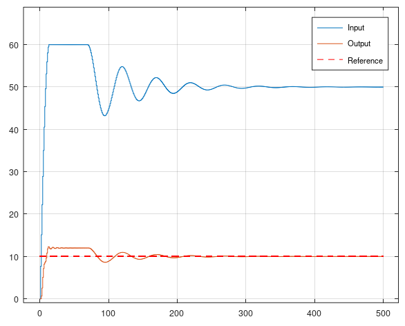

# MataveControl V13.0
MataveControl is a basic toolbox for control engineering. The toolbox can be used for both GNU Octave and MATLAB®. Easy to use and easy to install. The main focus of MataveControl is to offer a control toolbox which can be used in both GNU Octave and MATLAB®. MataveControl has the same function names as MATLAB®'s Control System Toolbox, but the time discrete functions are included in the time continuous functions. Also the library is a very basic library so other developers can fast dive into the code.


# TODO

- `reg.m` This need to be fixed so it is the same as MATLAB
- `lqgreg.m` I don't know if `Matavecontrol` should keep it. It do the same as `reg.m`.
- More work on `gensig.m`
- Make `linprog.m` faster by using vectorization and not C-code style
- Make `arma.m` return a transfer function with discrete time `1`
- ARMA models should be simulated with Euler-method, instead of `filter`.

# Typical use

To use MataveControl, you should allways start with to create a transfer function or a state space model. Then you can use that mathematical model in almost all the function of MataveControl. 

Here is some examples when I use MataveControl. MATLAB pictures are from Umeå University.

Creating a transfer function in MATLAB®


Creating a transfer function in GNU Octave


Create a bode diagram plot in MATLAB®


Create a bode diagram plot in GNU Octave


Create a state space model in MATLAB®


Create a state space model in GNU Octave 


Do a step simulation in MATLAB®


Do a step simulation in GNU Octave


Convert a time continuous transfer function to a discrete transfer function in MATLAB®


Convert a time continuous transfer function to a discrete transfer function in GNU Octave


Do a nyquist diagram plot in MATLAB®


Do a nyquist diagram plot in GNU Octave


# Model Predictive Control - Linear programming & Quadratic programming with integral action

MataveControl have both linear programming MPC and quadratic programming MPC. There is equivalent C code at [CControl](https://github.com/DanielMartensson/CControl) if you want to apply them to embedded hardware. Select the programming method, quadratic or linear, that works with your situation. Both works fine, but quadratic programming (Hildreth's Method) is faster than linear programming (Simplex Method) in MATLAB. In C-code, it depends on your C-compiler. I have done more work on `qmpc.m` file, compared to `lmpc.m`, even if they both can do the same job.

If you want to understand practical and proper MPC without theory, you should:
* Acquire all the math from the thesis Model Predictive Control for an artifical pancreas - Matias Sørensen og Simon Kristiansen.pdf (Download it here at MataveControl)
* Stody the chapters 1 and 2 from Model Predictive Control System Design and Implementation Using MATLAB® by Liuping Wang (Important that must be chapter 1 and 2, ignore the rest of the chapters)
* Throw away your lecture notes/literature from your MPC class, they just wasting your time

https://github.com/DanielMartensson/MataveControl/blob/03df47fbb3688b9a541b172b13386fc612dd7bc7/examples/mpcExample.m#L1-L26


# Model Predictive Control with Kalman-Bucy filter and plant simulation
This MPC is different from the above. This MPC contains a kalman filter and is meant to be used for implementation of MPC for micro controllers. This have a unique integral action, were the integral is added 
the reference vector `R` before optimizing with the QP-solver. The code follows the paper "Model Predictive Control for an artificial pancreas. Matias Sørensen og Simon Kristiansen", which can be found in this repository. 

```matlab
%% This is an oscillating mass-spring-damper system. Classical second order system
% ---------------------------------------------
% / / / / / / / / / / / / / / / / / / / / / / /
% ---------------------------------------------
%    |                        |
%    |                        |
%    |                        |
%    |                        |
%    |                        |
%    |                        |
%  | | |                     /
%  | | |                    /
%  | | |                    \
%  | | |                     \
%  | | |                      \
%  | | |                       \
%  | | | b = 1.2 [Ns/m]        /  k = 10 [N/m]
%  |_|_|                      /
%  |   |                      |
%  |   |                      |
%  |_ _|                      |
%    |                        |
%    |                        |
%    |                        |
%    |                        |
% ------------------------------------
% |                                  |
% |                                  |
% |             m  = 10 [kg]         |
% |                                  |---------
% ------------------------------------        |
%                 |                           |
%                 |                           | x [m]
%                 |                           V
%                 V
%                 F [N]
%
% System of equation (second order system):
%                                          m*ddx + b*dx + k*x = F
%
% State space (first order system):
%                                          dx1 = x2
%                                          dx2 = -x1*k/m - x2*b/m + F/m
%  [dx1] = [0       1]*[x1] + [0  ]
%  [dx2] = [-k/m -b/m]*[x2] + [1/m]*F
%   dx          A       x       B   u
%


%% Build the system plant model (The real world system plant model which we don't know)
m = 10;                      % Weight of the mass                                    (mandatory)
k = 10;                      % Spring force                                          (mandatory)
b = 2.2;                     % Damper force                                          (mandatory)
A = [0 1; -k/m -b/m];        % System matrix                                         (mandatory)
B = [0; 1/m];                % Input matrix                                          (mandatory)
C = [2 0];                   % Output matrix                                         (mandatory)
delay = 0;
sysp = mc.ss(delay, A, B, C);

%% Build the system controller model (The estimated real world model which is very similar to the real world system plant model)
m = 13.5;                    % Weight of the mass                                    (mandatory)
k = 8.7;                     % Spring force                                          (mandatory)
b = 3.1;                     % Damper force                                          (mandatory)
A = [0 1; -k/m -b/m];        % System matrix                                         (mandatory)
B = [0; 1/m];                % Input matrix                                          (mandatory)
C = [0.5 0];                 % Output matrix                                         (mandatory)
delay = 0;
sysc = mc.ss(delay, A, B, C);

%% Create the MPC parameters
N = 20;                      % Control horizon                                       (mandatory)
r = 10;                      % Reference                                             (mandatory)
umin = -1000;                    % Minimum input value on u                              (mandatory)
umax = 200;                   % Maximum input value on u                              (mandatory)
zmin = -1000;                    % Minimum output value on y                             (mandatory)
zmax = 1000;                  % Maximum output value on y                             (mandatory)
deltaumin = -300;               % Minimum rate of change on u                           (mandatory)
deltaumax = 300;              % Maximum rate of change on u                           (mandatory)
antiwindup = 100;             % Limits for the 1/s integral                           (mandatory)
lambda = 0.01;                % Integral rate                                         (optional)
Ts = 1;                      % Sample time for both models                           (optional)
T = 500;                     % End time for the simulation                           (optional)
x0 = [0; 0];                 % Intial state for the models sysp and sysc             (optional)
s = 1;                       % Regularization parameter (Faster to solve QP-problem) (optional)
Qz = 1;                      % Weight parameter for QP-solver                        (optional)
qw = 1;                      % Disturbance tuning for Kalman-Bucy filter             (optional)
rv = 0.1;                    % Noise tuning for Kalman-Bucy filter                   (optional)
Spsi_spsi = 1;               % Slackvariable tuning for H matrix and gradient g      (optional)
d = 3;                       % Disturbance signal at step iteration k = 0            (optional)
E = [0; 0];                  % Disturbance signal matrix for both sysp and sysc      (optional)

%% Run MPC with Kalman-bucy filter
%                                                         d
%                                                         |
%                                                         |
%                        ____________                 _____V_______
%             + _       |            |               |            |
%    ---r--|---|_|--R-->|  MPC + KF  |-------u------>|    PLANT   |----------y------>
%          |   +Λ       |____________|               |____________|          |
%          |    |                         ___                                |
%          |    |                        | 1 |      _       _ -              |
%          |    -------------------------- - |<----|λ|<----|_|<---------------
%          |                             | s |      -       |+
%          |                              ---               |
%          -------------------------------------------------

[Y, T, X, U] = mc.kf_qmpc(sysp, sysc, N, r, umin, umax, zmin, zmax, deltaumin, deltaumax, antiwindup, lambda, Ts, T, x0, s, Qz, qw, rv, Spsi_spsi, d, E);

% Print the output
R = r*ones(length(T));
plot(T, U, T, Y, T, R, 'r--');
legend('Input', 'Output', 'Reference')
grid on
```

This is the output where the plant model and the MPC model are not the same. Still, the error tracking can be minimized. 



# Install
To install MataveControl, download the folder "matave" and place it where you want it. Then the following code need to be written inside of the terminal of your MATLAB® or GNU Octave program. 

```matlab
path('path/to/the/folder/matave', path)
savepath
```
Example of a typical path.

```matlab
path('C:\Users\dmn\Documents\Octave\matave\', path)
savepath
```

# Update
Write this inside the terminal. Then MataveControl is going to download new .m files to MataveControl from GitHub

```matlab
mc.updatematavecontrol
```

