# MataveControl V11.0
MataveControl is a basic toolbox for control engineering. The toolbox can be used for both GNU Octave and MATLAB®. Easy to use and easy to install. The main focus of MataveControl is to offer a control toolbox which can be used in both GNU Octave and MATLAB®. MataveControl has the same function names as MATLAB®'s Control System Toolbox, but the time discrete functions are included in the time continuous functions. Also the library is a very basic library so other developers can fast dive into the code.


# TODO

- `reg.m` This need to be fixed so it is the same as MATLAB
- `lqgreg.m` I don't know if `Matavecontrol` should keep it. It do the same as `reg.m`.
- More work on `gensig.m`
- Make `linprog.m` faster by using vectorization and not C-code style
- Make `arma.m` return a transfer function with discrete time `1`
- ARMA models should be simulated with Euler-method, instead of `filter`.

# Typical use

To use MataveControl, you should allways start with to create a transfer function or a state space model. Then you can use that mathematical model in almost all the function of MataveControl. 

Here is some examples when I use MataveControl. MATLAB pictures are from Umeå University.

Creating a transfer function in MATLAB®

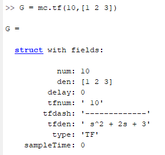

Creating a transfer function in GNU Octave

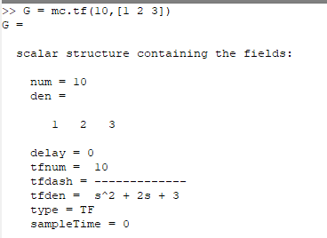

Create a bode diagram plot in MATLAB®

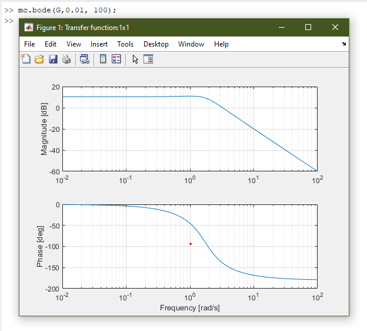

Create a bode diagram plot in GNU Octave

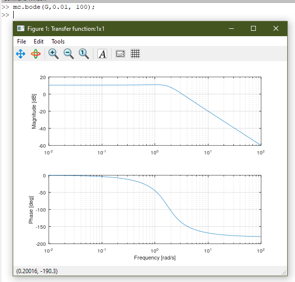

Create a state space model in MATLAB®

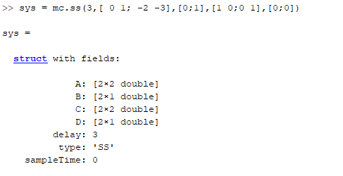

Create a state space model in GNU Octave 

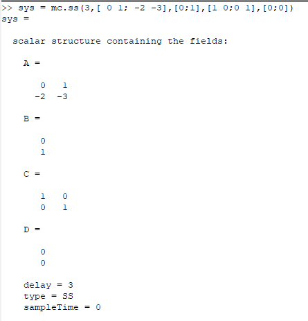

Do a step simulation in MATLAB®

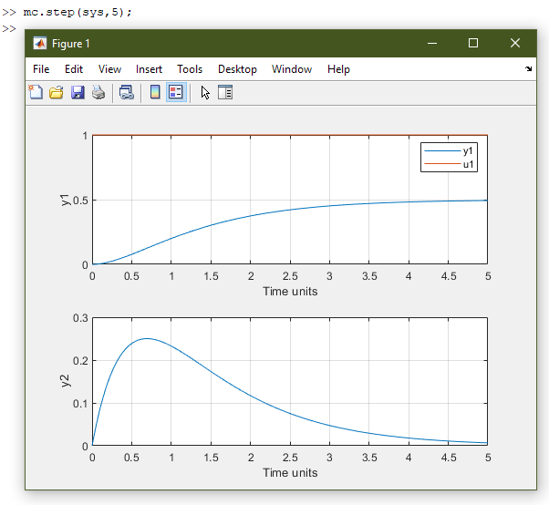

Do a step simulation in GNU Octave

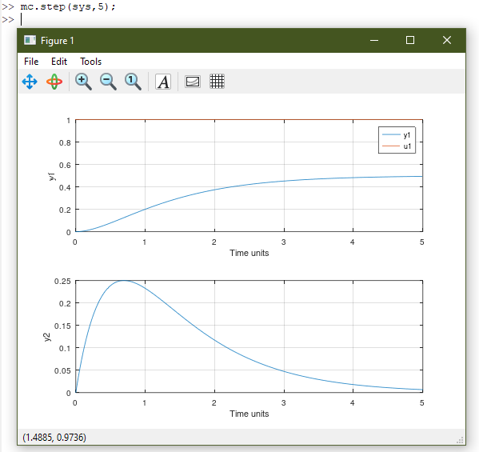

Convert a time continuous transfer function to a discrete transfer function in MATLAB®

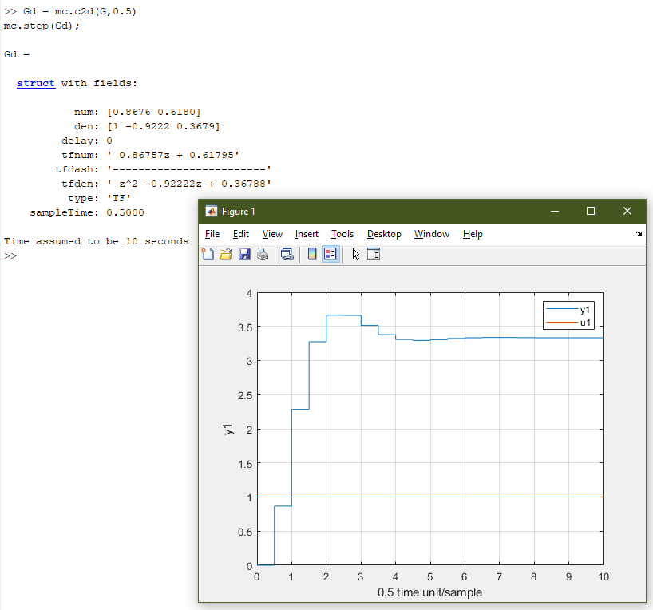

Convert a time continuous transfer function to a discrete transfer function in GNU Octave

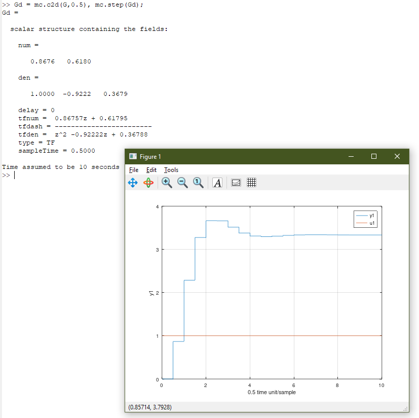

Do a nyquist diagram plot in MATLAB®

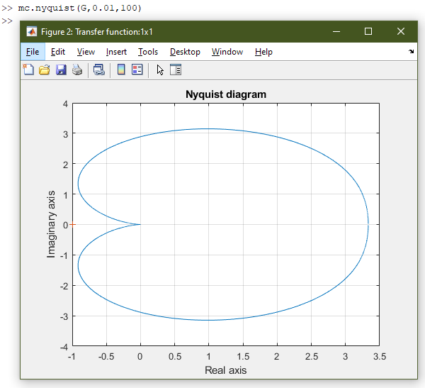

Do a nyquist diagram plot in GNU Octave

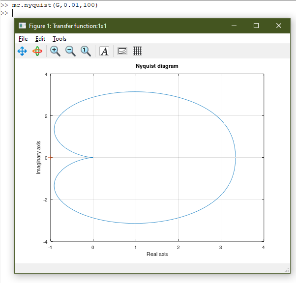

# Model Predictive Control - Linear programming & Quadratic programming with integral action

MataveControl have both linear programming MPC and quadratic programming MPC. There is equivalent C code at [CControl](https://github.com/DanielMartensson/CControl) if you want to apply them to embedded hardware. Select the programming method, quadratic or linear, that works with your situation. Both works fine, but quadratic programming (Hildreth's Method) is faster than linear programming (Simplex Method) in MATLAB. In C-code, it depends on your C-compiler.

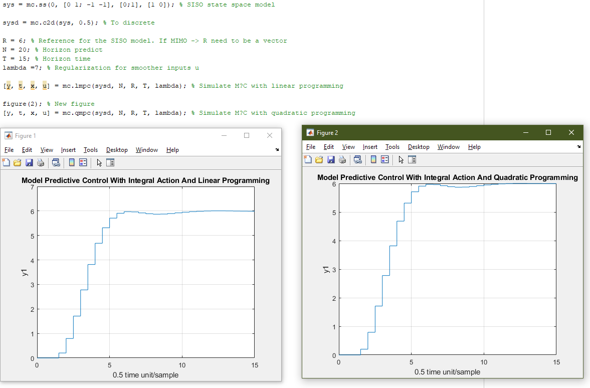

# Install
To install MataveControl, download the folder "matave" and place it where you want it. Then the following code need to be written inside of the terminal of your MATLAB® or GNU Octave program. 

```matlab
path('path/to/the/folder/matave', path)
savepath
```
Example of a typical path.

```matlab
path('C:\Users\dmn\Documents\Octave\matave\', path)
savepath
```

# Update
Write this inside the terminal. Then MataveControl is going to download new .m files to MataveControl from GitHub

```matlab
mc.updatematavecontrol
```

